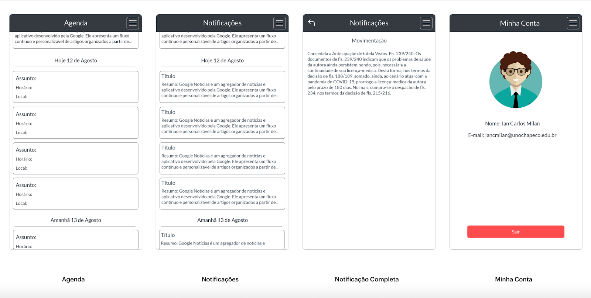

  

![mobile] ![top_language] ![repo-size]

### 🕵️‍♂️ Aplicativo desenvolvido durante a disciplina Prática Profissional II, utilizando a tecnologia React Native.

## :bookmark: Sobre

Aplicativo desenvolvido durante a disciplina Prática Profissional II, o **AppSP** foi uma demanda de uma empresa na qual realizei minha prática, suas principais funcionalidades são: usuário pode ver notícias relacionadas a sua área de atuação e ver sua agenda e notificações para auxilia-lo em seus compromissos.

## :clipboard: Metodologia

No projeto da prática profissional precisei seguir um cronograma e registrar os passos do desenvolvimento do aplicativo, que foram os seguintes:

#### Estudo da biblioteca React Native

* React é uma biblioteca Javascript criada pelo Facebook;
* Utilizada para desenvolver aplicativos Android e IOS de forma nativa;
* Nos 4 dias dessa atividade o foco foi entender os três principais conceitos do React;
* Componentização;
* Propriedade;
* Estado.

#### Desenvolvimento dos wireframes

* Utilizei a ferramenta MarvelApp;
* Por motivos de contrato não é possível divulgar o nome da empresa;
* Com base nisso foi utilizado nome e logo fictícios.

#### Estrutura e rotas

* Foram utilizados dois tipos de navegação;
* Drawer Navigation(Menu);
* Stack Navigation(Navegação em pilha).

#### Componente Header

* Um dos principais conceitos do React é a componentização;
* Componentes são conjuntos isolados de código que podem ser reutilizados;
* Sempre quando temos códigos que podem ser independentes e que irão ser reutilizados devemos criar componentes;
* Como o Header se repete em todas as páginas da aplicação é valido a criação desse componente;
* Também foi utilizado o conceito de propriedade;
* Propriedade é o conceito de enviarmos informações de um componente pai para um componente filho;
* Nesse caso enviamos o título de cada página por meio de propriedades.

#### Componentes DateHeader, NewsItem, ScheduleItem e NotificationItem

* Seguindo a lógica da criação do Header foram criados esses outros componentes(vão ser utilizados várias vezes na aplicação);
* DateHeader é o componente que mostra as datas;
* NewsItem é cada item das notícias;
* ScheduleItem é cada item da agenda;
* NotificationItem é cada item das notificações;
* Nessa atividade também foi mudada a cor da DrawerNavigation.

#### Autenticação

* Uma das regras de negócio do aplicativo é exigir que o usuário esteja logado para acessar as telas de agenda e minha conta;
* Para a autenticação foi utilizado a ContextApi e os Hooks do React Native;
* Também foi utilizada a AsyncStorage pra guardar informações da memória do dispositivo.

## :rocket: Tecnologias

O projeto foi desenvolvido com as seguintes tecnologias:

- [React Native](https://facebook.github.io/react-native/)
- [Expo](https://expo.io/)

## :computer: Wireframes do aplicativo

Obs: Logo e nome usados no aplicativo e wireframes são fictícios por motivos de contrato com a empresa.

  
  

## :iphone: Resultado final

<!-- Bagdes -->
[mobile]: https://img.shields.io/badge/mobile-React%20Native-e5e5e5?style=flat-square&labelColor=121214
[top_language]: https://img.shields.io/github/languages/top/iancmilan/app-sp?style=flat-square&color=e5e5e5&labelColor=121214
[repo-size]: https://img.shields.io/github/repo-size/iancmilan/app-sp?style=flat-square&color=e5e5e5&labelColor=121214
